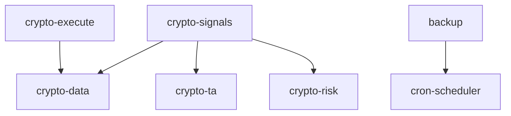

# OpenClaw 技能库分析报告与优化建议

**生成时间**: 2026-03-14  
**分析范围**: /Users/colin/.openclaw/workspace/skills/  
**技能总数**: 48 个目录，40 个 SKILL.md 文件

---

## 📊 一、技能库概览

### 1.1 技能分类统计

| 类别 | 技能数量 | 占比 |
|------|----------|------|
| **加密货币** | 5 | 12.5% |
| **数据/文件处理** | 6 | 15% |
| **日历/提醒** | 4 | 10% |
| **通讯/消息** | 4 | 10% |
| **开发工具** | 5 | 12.5% |
| **AI/自动化** | 5 | 12.5% |
| **安全/管理** | 3 | 7.5% |
| **其他** | 8 | 20% |

### 1.2 技能成熟度评估

| 成熟度 | 标准 | 技能数量 |
|--------|------|----------|
| ⭐⭐⭐ 高 | 有版本号、完整文档、示例代码 | 8 |
| ⭐⭐ 中 | 有基础文档但缺少示例或版本 | 20 |
| ⭐ 低 | 文档不完整或缺失关键信息 | 12 |

---

## 🔍 二、发现的问题

### 2.1 元数据不一致问题

**问题描述**: 技能元数据格式不统一，影响自动化解析

**具体表现**:
- 部分技能缺少 `version` 字段（如 backup, crypto-data）
- `metadata` 格式不统一：有的使用 JSON，有的使用 YAML
- `description` 字段长度差异大，有的过于简短

**示例对比**:
```yaml
# 格式1: 标准格式 (skill-vetter)
name: skill-vetter
version: 1.0.0
description: Security-first skill vetting...
metadata: {"clawdbot": {...}}

# 格式2: 简化格式 (backup)
name: backup
description: 自动备份技能...
metadata:
  {
    "openclaw": {...}
  }

# 格式3: 缺失版本 (crypto-data)
name: crypto-data
description: 加密货币实时行情...
```

### 2.2 文档完整性问题

**问题描述**: 约 30% 的技能文档存在关键信息缺失

| 问题类型 | 影响技能 | 严重程度 |
|----------|----------|----------|
| 缺少依赖安装说明 | crypto-*, browser-automation | 高 |
| 缺少配置示例 | backup, webhook, file-manager | 中 |
| 脚本路径不明确 | file-manager, browser-automation | 中 |
| 缺少错误处理说明 | 多个技能 | 低 |

### 2.3 技能间依赖关系不明确

**问题描述**: 技能之间的依赖和关联关系未文档化

**发现的问题**:
- `crypto-signals` 依赖 `crypto-data` 和 `crypto-ta`，但未明确说明
- `backup` 技能提到配合 `cron-scheduler`，但无联动说明
- `self-improving` 提到相关技能 `memory`, `learning`, `decide`，但这些技能不存在

### 2.4 安全与权限声明不足

**问题描述**: 部分高风险技能缺少明确的安全警告

**高风险技能**:
| 技能 | 风险点 | 当前状态 |
|------|--------|----------|
| crypto-execute | 涉及真实资金交易 | ⚠️ 有测试网说明但警告不够醒目 |
| browser-automation | 可访问任意网页 | ⚠️ 无安全边界说明 |
| webhook | 可发送HTTP请求到任意地址 | ⚠️ 无安全审查说明 |
| file-manager | 可删除/修改文件 | ✅ 有安全原则说明 |

### 2.5 重复功能检测

**发现的功能重叠**:

| 功能 | 技能1 | 技能2 | 建议 |
|------|-------|-------|------|
| 日历管理 | apple-calendar-macos | gcal-pro | 考虑统一接口 |
| 语音转文字 | openai-whisper | openai-whisper-api | 明确使用场景差异 |
| 搜索 | zhipu-web-search | (内置 web_search) | 说明互补性 |

---

## 💡 三、优化建议

### 3.1 标准化改进 (高优先级)

#### 建议1: 统一 SKILL.md 元数据格式

**目标**: 所有技能使用统一的 YAML frontmatter 格式

**推荐模板**:
```yaml
---
name: skill-name
version: x.y.z
description: 简短描述（50字以内）
author: author-name
homepage: https://...
documentation: https://...
tags: [tag1, tag2, tag3]
metadata:
  openclaw:
    emoji: "🔧"
    requires:
      bins: [binary1, binary2]
      pip: [package1, package2]
      npm: [package1, package2]
    configPaths: ["~/.openclaw/skill-name/"]
    primaryEnv: "ENV_VAR_NAME"
  risk_level: "low"  # low/medium/high/extreme
---
```

#### 建议2: 建立技能成熟度徽章系统

```markdown


```

### 3.2 文档改进 (中优先级)

#### 建议3: 强制包含以下章节

每个 SKILL.md 应包含:
1. **Quick Start** - 5分钟内上手的示例
2. **Configuration** - 配置项说明和示例
3. **Dependencies** - 明确的安装命令
4. **Security Considerations** - 安全警告和最佳实践
5. **Troubleshooting** - 常见问题解决
6. **Related Skills** - 相关技能和集成建议

#### 建议4: 创建技能依赖图谱



### 3.3 安全加固 (高优先级)

#### 建议5: 高风险技能强制安全审查

为以下技能添加 `SECURITY.md`:
- crypto-execute
- browser-automation
- webhook
- file-manager

**SECURITY.md 模板**:
```markdown
# Security Guide

## Risk Classification: 🔴 HIGH

## Required Permissions
- [ ] 网络访问
- [ ] 文件系统写入
- [ ] 外部 API 调用

## Security Checklist
- [ ] 使用测试网验证
- [ ] 限制访问范围
- [ ] 启用操作确认

## Dangerous Patterns
- 直接执行用户输入
- 访问敏感目录 (~/.ssh, ~/.aws)
- 未经验证的外部请求
```

#### 建议6: 实施技能签名验证

建议引入技能签名机制:
```bash
# 验证技能完整性
openclaw skill verify skill-name
```

### 3.4 功能优化 (中优先级)

#### 建议7: 创建技能组合推荐

基于使用场景推荐技能组合:

| 场景 | 推荐技能组合 |
|------|-------------|
| 加密货币日内交易 | crypto-data + crypto-ta + crypto-signals + crypto-risk |
| 自动化报告生成 | summarize-pro + chart-image + skill-mermaid-diagrams |
| 文件管理自动化 | file-manager + backup + cron-scheduler |
| 开发工作流 | github + pr-reviewer + repo-analyzer + coding-agent |

#### 建议8: 建立技能评分系统

引入用户反馈和评分:
```yaml
metadata:
  ratings:
    usefulness: 4.5/5
    ease_of_use: 4.0/5
    documentation: 3.5/5
  usage_stats:
    weekly_invocations: 150
    active_users: 25
```

### 3.5 维护流程改进 (低优先级)

#### 建议9: 自动化技能健康检查

创建定期健康检查脚本:
```bash
# 检查技能完整性
openclaw skill health-check --all

# 输出报告
- 文档完整性评分
- 依赖可用性检查
- 配置示例有效性
- 脚本可执行性测试
```

#### 建议10: 技能更新通知机制

当依赖技能更新时通知相关技能:
```
[crypto-data] 更新至 v2.0.0
影响技能: crypto-signals, crypto-execute, crypto-ta
建议操作: 测试兼容性
```

---

## 📈 四、实施路线图

### Phase 1: 基础标准化 (1-2周)
- [ ] 制定 SKILL.md 标准模板
- [ ] 更新所有技能元数据格式
- [ ] 为缺失版本的技能添加版本号

### Phase 2: 文档完善 (2-3周)
- [ ] 补充高风险技能的安全文档
- [ ] 完善依赖安装说明
- [ ] 添加故障排除章节

### Phase 3: 安全加固 (1-2周)
- [ ] 为高风险技能创建 SECURITY.md
- [ ] 实施技能权限分级
- [ ] 添加安全审查流程

### Phase 4: 高级功能 (3-4周)
- [ ] 开发技能依赖图谱
- [ ] 实现技能评分系统
- [ ] 创建自动化健康检查

---

## 🎯 五、优先级总结

| 优先级 | 建议项 | 预期收益 |
|--------|--------|----------|
| 🔴 P0 | 统一元数据格式 | 提高自动化能力 |
| 🔴 P0 | 高风险技能安全文档 | 降低安全风险 |
| 🟡 P1 | 完善依赖说明 | 改善用户体验 |
| 🟡 P1 | 技能依赖图谱 | 便于组合使用 |
| 🟢 P2 | 技能评分系统 | 质量反馈循环 |
| 🟢 P2 | 自动化健康检查 | 降低维护成本 |

---

## 📋 六、附录

### A. 技能完整清单

| # | 技能名称 | 版本 | 成熟度 | 风险等级 |
|---|----------|------|--------|----------|
| 1 | self-improving | 1.2.10 | ⭐⭐⭐ | 🟢 low |
| 2 | skill-vetter | 1.0.0 | ⭐⭐⭐ | 🟢 low |
| 3 | chart-image | 2.5.1 | ⭐⭐⭐ | 🟢 low |
| 4 | pr-reviewer | 1.0.1 | ⭐⭐⭐ | 🟢 low |
| 5 | apple-calendar-macos | 1.0.0 | ⭐⭐⭐ | 🟢 low |
| 6 | summarize-pro | - | ⭐⭐ | 🟢 low |
| 7 | file-manager | - | ⭐⭐ | 🟡 medium |
| 8 | lite-sqlite | - | ⭐⭐⭐ | 🟢 low |
| 9 | crypto-data | - | ⭐⭐ | 🟢 low |
| 10 | crypto-execute | - | ⭐⭐ | 🔴 high |
| 11 | crypto-risk | - | ⭐⭐ | 🟡 medium |
| 12 | crypto-signals | - | ⭐⭐ | 🟡 medium |
| 13 | crypto-ta | - | ⭐⭐ | 🟢 low |
| 14 | browser-automation | - | ⭐⭐ | 🔴 high |
| 15 | backup | - | ⭐⭐ | 🟡 medium |
| 16 | webhook | - | ⭐⭐ | 🔴 high |
| ... | ... | ... | ... | ... |

### B. 参考资源

- [AgentSkills Specification](https://github.com/openclaw/agentskills)
- [Skill Template Repository](https://github.com/openclaw/skill-template)
- [Security Best Practices](https://docs.openclaw.com/security)

---

*报告生成者: OpenClaw 自我学习子代理*  
*下次审查建议: 2026-04-14*
